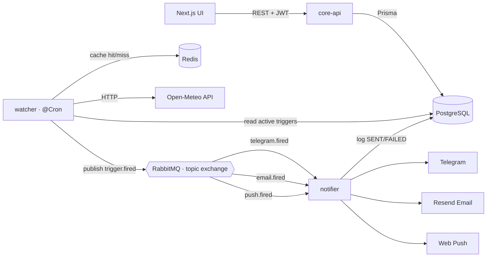

# Weather Notify — Event-Driven Alerting System (Backend)

Microservice backend that lets users define **weather triggers** (custom thresholds or
severe-weather alerts for a city) and delivers notifications over **Telegram, Email and
Web Push**. Built as a NestJS monorepo with an asynchronous, message-driven core.

> Frontend lives in a separate repository: `weather_notify_web` (Next.js).

## Architecture



### Why asynchronous / microservices?

- **Decoupling & resilience** — the watcher never blocks on slow notification delivery.
  It emits an event and moves on; the notifier consumes at its own pace.
- **Independent scaling** — polling, delivery and the API scale separately.
- **Reliable delivery** — RabbitMQ gives at-least-once delivery with a dead-letter
  retry topology, so transient failures (a flaky Telegram/SMTP call) are retried with
  backoff instead of being lost.

## Services

| Service | Role |
|---------|------|
| **core-api** | REST API: JWT auth, triggers CRUD, user/Telegram/push management, notifications history, Swagger |
| **watcher** | `@Cron` job: groups active triggers by location, polls Open-Meteo (Redis-cached), evaluates conditions, publishes `trigger.fired` |
| **notifier** | Consumes per-channel queues, delivers via Telegram/Email/Web Push with retry/DLQ, persists every outcome |

Shared code lives in `libs/`: `database` (Prisma), `contracts` (event DTOs, routing keys,
enums), `common` (`evaluateCondition`, Redis).

## Tech stack

Node 22 · TypeScript · NestJS 11 · Prisma 6 + PostgreSQL · RabbitMQ ·
Redis · Passport/JWT · Open-Meteo · Resend · web-push · Docker Compose · GitHub Actions.

## Anti-spam design

Each trigger has a state machine (`ARMED` → `FIRED`) plus a per-trigger `cooldownMin`.
A trigger fires when the condition first becomes true (ARMED) and re-fires only after the
cooldown elapses; when the condition clears it re-arms (hysteresis). This prevents a
sustained condition (e.g. "temperature > 30°C") from emitting an alert every cycle.

## Getting started

```bash
cp .env.example .env          # fill in channel secrets (optional for local dev)
docker compose up -d          # postgres, redis, rabbitmq + all three services
```

Local development (services on the host, infra in Docker):

```bash
docker compose up -d postgres redis rabbitmq
npm install
npm run db:migrate            # apply migrations
npm run start:core-api        # + start:watcher / start:notifier in separate shells
```

- Swagger UI: <http://localhost:3000/docs>
- RabbitMQ management UI: <http://localhost:15672> (weather / weather)

## Testing

```bash
npm test          # unit tests (condition evaluation, ...)
npm run test:e2e  # auth + triggers CRUD against a real Postgres
```

## Deployment

The stack runs 24/7 for free on an **Oracle Cloud Always Free** ARM VM via
`docker compose up -d` (no cold starts). All three images are produced from a single
parameterized `Dockerfile` (`APP` arg).

## Security

Public repo: only `.env.example` is committed. All secrets (DB, JWT, bot token, Resend,
VAPID) are provided via environment variables.
