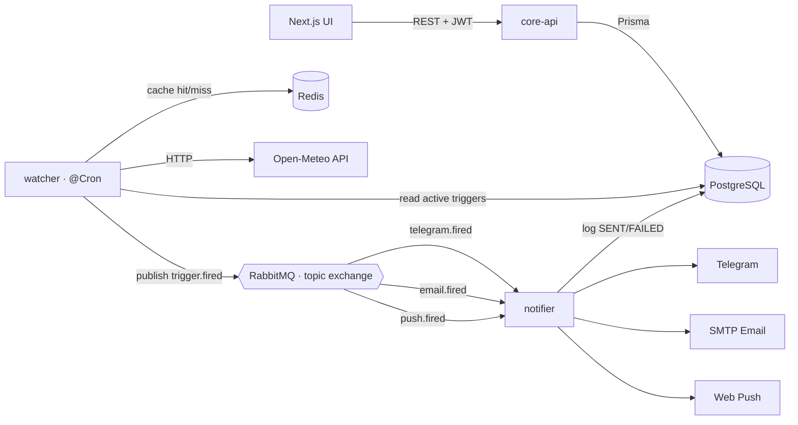

# Weather Notify — Event-Driven Alerting System (Backend)

Microservice backend that lets users define **weather triggers** (custom thresholds or
severe-weather alerts for a city) and delivers notifications over **Telegram, Email and
Web Push**. Built as a NestJS monorepo with an asynchronous, message-driven core.

> Frontend lives in a separate repository: `weather_notify_web` (Next.js).

## Architecture



### Why asynchronous / microservices?

- **Decoupling & resilience** — the watcher never blocks on slow notification delivery.
  It emits an event and moves on; the notifier consumes at its own pace.
- **Independent scaling** — polling, delivery and the API scale separately.
- **Reliable delivery** — RabbitMQ gives at-least-once delivery with a dead-letter
  retry topology, so transient failures (a flaky Telegram/SMTP call) are retried with
  backoff instead of being lost.

## Services

| Service | Role |
|---------|------|
| **core-api** | REST API: JWT auth, triggers CRUD, user/Telegram/push management, notifications history, Swagger (dev only) |
| **watcher** | `@Cron` job: groups active triggers by location, polls Open-Meteo (Redis-cached), evaluates conditions, publishes `trigger.fired` |
| **notifier** | Consumes per-channel queues, delivers via Telegram/Email/Web Push with retry/DLQ, persists every outcome |

Shared code lives in `libs/`: `database` (Prisma), `contracts` (event DTOs, routing keys,
enums), `common` (config validation, Redis, mailer, metrics, `evaluateConditions`,
`isWithinQuietHours`).

## Key features

- **Multi-condition triggers** with AND/OR logic (e.g. *temp > 30 °C **and** wind > 40 km/h*).
- **Anti-spam state machine** (`ARMED` → `FIRED`) with per-trigger cooldown and hysteresis.
- **Quiet hours** — per-user, timezone-aware do-not-disturb window (wraps past midnight).
- **Three delivery channels** with a unified retry/DLQ pipeline and per-channel queues.
- **Email verification** (soft gate) and **Telegram deep-link binding** via long-polling bot.
- **Prometheus metrics** on a separate, unpublished port; structured logging via pino.

## Security

- **Auth** — bcrypt (cost 12) password hashing; short-lived access JWT + rotating refresh
  token stored **hashed** in the DB. Refresh rotation includes **reuse detection**: replaying
  an already-rotated token revokes the user's entire token family.
- **Refresh token transport** — delivered in an `httpOnly`, `SameSite`, path-scoped cookie
  (never exposed to JS); `Secure` in production.
- **Hardening** — `helmet`, explicit CORS allow-list (no wildcard reflection), global +
  per-route rate limiting (`@nestjs/throttler`), `ValidationPipe` with
  `whitelist`/`forbidNonWhitelisted`.
- **Input validation** — every DTO is validated (class-validator); IANA timezones and
  push endpoints are checked, and user-supplied text is HTML-escaped in outgoing emails.
- **Fail-fast config** — environment is validated with zod at boot; secrets must be ≥ 32
  chars and cannot be left as placeholders.
- **Least privilege** — Docker images run as a non-root user; infra ports bind to loopback.

## Tech stack

Node 22 · TypeScript · NestJS 11 · Prisma 6 + PostgreSQL · RabbitMQ ·
Redis · Passport/JWT · Open-Meteo · Nodemailer (SMTP) · web-push · Docker Compose · GitHub Actions.

## Anti-spam design

Each trigger has a state machine (`ARMED` → `FIRED`) plus a per-trigger `cooldownMin`.
A trigger fires when the condition first becomes true (ARMED) and re-fires only after the
cooldown elapses; when the condition clears it re-arms (hysteresis). This prevents a
sustained condition (e.g. "temperature > 30 °C") from emitting an alert every cycle.

## Getting started

```bash
cp .env.example .env          # set JWT secrets (≥32 chars) + channel secrets
docker compose up -d          # postgres, redis, rabbitmq + all three services
```

Local development (services on the host, infra in Docker):

```bash
docker compose up -d postgres redis rabbitmq
npm install
npm run db:migrate            # apply migrations
npm run start:core-api        # + start:watcher / start:notifier in separate shells
```

- Swagger UI (dev only): <http://localhost:3000/docs>
- RabbitMQ management UI: enable the `15672` port in `docker-compose.yml` (dev only)

## Environment

| Variable | Description |
|----------|-------------|
| `DATABASE_URL` | PostgreSQL connection string |
| `REDIS_URL` | Redis connection string (cache + cooldowns) |
| `RABBITMQ_URL` | RabbitMQ AMQP URL |
| `JWT_ACCESS_SECRET` / `JWT_REFRESH_SECRET` | JWT signing secrets (**≥ 32 chars**, no placeholders) |
| `JWT_ACCESS_TTL` / `JWT_REFRESH_TTL` | Token lifetimes (e.g. `15m`, `7d`) |
| `CORS_ORIGIN` | Comma-separated allow-list of frontend origins |
| `COOKIE_SAMESITE` | Refresh-cookie `SameSite` (`lax` default; `none` for cross-site frontends) |
| `TELEGRAM_BOT_TOKEN` / `TELEGRAM_BOT_USERNAME` | Telegram bot credentials (optional) |
| `SMTP_HOST` / `SMTP_PORT` / `SMTP_USER` / `SMTP_PASS` / `MAIL_FROM` | SMTP mailer (optional; links logged if unset) |
| `VAPID_PUBLIC_KEY` / `VAPID_PRIVATE_KEY` / `VAPID_SUBJECT` | Web Push (VAPID) keys (optional) |
| `WATCHER_CRON` | Polling cadence (default every 5 min) |
| `CORE_API_PORT` | Public API port (default 3000) |

## Testing

```bash
npm test          # unit tests (condition evaluation, quiet hours, consumer, ...)
npm run test:e2e  # auth + triggers + admin against a real Postgres
```

CI (GitHub Actions) runs lint, typecheck, unit + e2e tests with a coverage gate.

## Deployment

Runs 24/7 for free on an **Oracle Cloud Always Free** ARM VM via `docker compose up -d`
(no cold starts). All three services build from a single parameterized `Dockerfile`
(`APP` build arg) and run as a non-root user. See `weather_notify_web` for the matching
frontend deploy (Vercel).

---

Created by [Aliaksei Konyshau](https://aliaksei-konyshau.vercel.app/).
