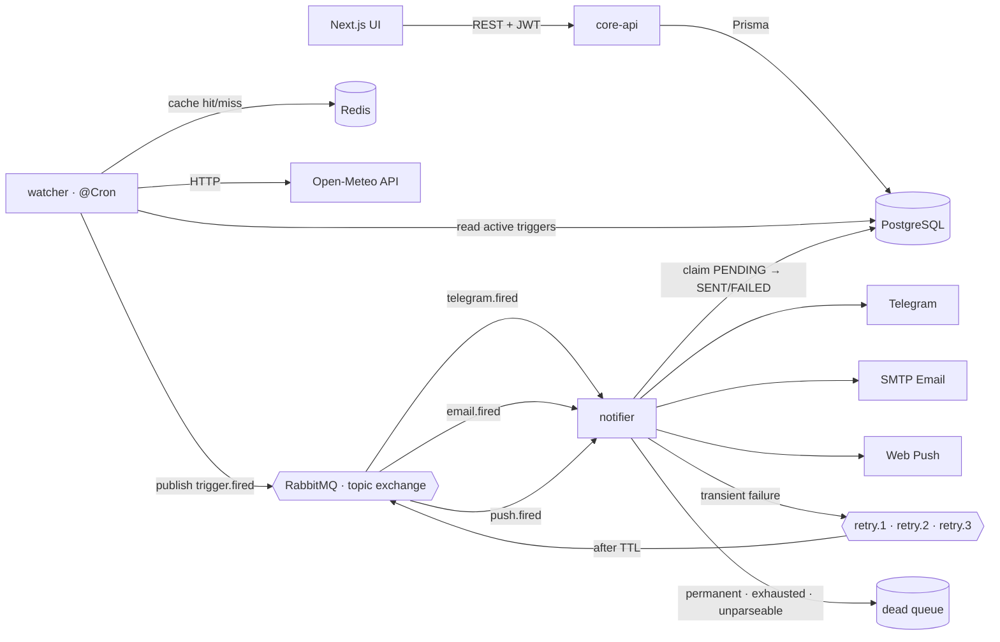

# Weather Notify — Event-Driven Alerting System (Backend)

Microservice backend that lets users define **weather triggers** (custom thresholds or
severe-weather alerts for a city) and delivers notifications over **Telegram, Email and
Web Push**. Built as a NestJS monorepo with an asynchronous, message-driven core.

> Frontend lives in a separate repository: `weather_notify_web` (Next.js).

## Architecture


```mermaid
flowchart LR
    UI[Next.js UI] -->|REST + JWT| API[core-api]
    API -->|Prisma| PG[(PostgreSQL)]
    WATCH[watcher · @Cron] -->|read active triggers| PG
    WATCH -->|cache hit/miss| REDIS[(Redis)]
    WATCH -->|HTTP| OM[Open-Meteo API]
    WATCH -->|publish trigger.fired| MQ{{RabbitMQ · topic exchange}}
    MQ -->|telegram.fired| NOTIF[notifier]
    MQ -->|email.fired| NOTIF
    MQ -->|push.fired| NOTIF
    NOTIF --> TG[Telegram]
    NOTIF --> MAIL[SMTP Email]
    NOTIF --> WP[Web Push]
    NOTIF -->|claim PENDING → SENT/FAILED| PG
    NOTIF -->|transient failure| RETRY{{retry.1 · retry.2 · retry.3}}
    RETRY -->|after TTL| MQ
    NOTIF -->|permanent · exhausted · unparseable| DEAD[(dead queue)]
```

## Services

| Service | Role |
|---------|------|
| **core-api** | REST API: JWT auth, triggers CRUD, user/Telegram/push management, notifications history, Swagger (dev only) |
| **watcher** | `@Cron` job: groups active triggers by location, polls Open-Meteo (Redis-cached), evaluates conditions, publishes `trigger.fired` |
| **notifier** | Consumes per-channel queues, delivers via Telegram/Email/Web Push with retry/DLQ, persists every outcome |

Shared code lives in `libs/`:

| Library | Contents |
|---------|----------|
| **domain** | Condition evaluation, quiet hours, the trigger state machine, and the enums the system is defined in terms of. Zero imports of Nest, Prisma or IO — enforced by an eslint rule. |
| **contracts** | Event shapes, routing keys, message headers and the `EventPublisher` port. |
| **database** | Prisma client, plus a compile-time assertion that the schema's enums still match the domain's. |
| **common** | Infrastructure: config validation, Redis, mailer, metrics, log correlation, the RabbitMQ publisher. |

## Architecture decisions

Decisions worth arguing about, and why they went the way they did.

### Why microservices, and why a broker?

Three processes, one deployment unit, one database. It is not microservices for
scale — the load does not need it — but for **failure isolation**. Delivery is the
part that talks to Telegram, SMTP and push services, all of which fail in ways
outside our control. Keeping it behind a queue means a five-minute SMTP outage
does not stall the poll cycle, and a slow channel cannot delay an unrelated one.

The broker also buys ordering-free fan-out: one fired event lands on the channel
queues the trigger names, each retried independently. Doing that in-process would
mean either sequential delivery (one bad channel blocks the rest) or hand-rolled
concurrency with the same retry and persistence problems, solved worse.

**What was given up:** a single fired event now needs an idempotency claim in the
database (below), and every developer needs RabbitMQ running locally. Both are
paid for once and by the platform, not per feature.

### Why not full Clean Architecture?

The domain is genuinely small — thresholds, a cooldown, a quiet window. Wrapping
CRUD over a handful of rows per user in entities, use-case interactors and mappers
would be more code than the rules it protects. So the split is drawn at exactly
one line: **`libs/domain` is pure, everything else may be infrastructure.**

`libs/domain` imports nothing from Nest, Prisma, or any IO package, and an eslint
`no-restricted-imports` rule scoped to that directory keeps it that way. That is
the whole boundary. Ports exist only where something real crosses it — the
upstream weather API, the broker, and the watcher's read model — not as a uniform
tax on every service.

### Why does `libs/database` know about the domain, and not the reverse?

The domain declares `Metric`, `Operator`, `ConditionLogic`, `TriggerState`,
`Channel` and `NotifStatus`. Prisma generates its own copies from the schema.
Rather than have the domain import the ORM's enums, `libs/database` asserts the
two vocabularies are mutually assignable:

```ts
type AssertEqual<A, B> = [A] extends [B] ? ([B] extends [A] ? true : never) : never;
export const DOMAIN_ENUMS_MATCH_PRISMA: [AssertEqual<Metric, PrismaMetric>, /* … */] = [true, /* … */];
```

Adding a value on one side alone fails the build here, where the two vocabularies
meet, instead of at runtime. The arrow points from persistence to the domain
because that is the direction the dependency should run.

### Why CQRS in one module only?

`triggers` goes through `@nestjs/cqrs`; nothing else does. Triggers are the only
place where the write side carries rules the read side does not share — an email
verification gate, a per-user limit, a test-send cooldown — so separating them
buys something. The rest of the API is CRUD over a handful of rows per user, and
a bus there would be ceremony with a worse stack trace.

The boundary is the point. A codebase where every module has commands and queries
says nothing about the code; one where a single module does says the split was a
decision.

## Key features

- **Multi-condition triggers** with AND/OR logic (e.g. *temp > 30 °C **and** wind > 40 km/h*).
- **Anti-spam state machine** (`ARMED` → `FIRED`) with per-trigger cooldown and hysteresis.
- **Quiet hours** — per-user, timezone-aware do-not-disturb window (wraps past midnight).
- **Three delivery channels** behind a registry — adding one is a single array entry,
  with the queue topology derived from it.
- **Exactly-once delivery in practice** on top of at-least-once transport, via a
  `(eventId, channel)` claim.
- **Staged retry + a real dead-letter queue** with the reason recorded on the message.
- **Email verification** (soft gate) and **Telegram deep-link binding** via long-polling bot.
- **Prometheus metrics** on a separate, unpublished port; structured logging via pino with
  per-delivery correlation.
- **Generated client contract** — `openapi.json` is committed and CI fails if it drifts.

## Security

- **Auth** — bcrypt (cost 12) password hashing; short-lived access JWT + rotating refresh
  token stored **hashed** in the DB. Refresh rotation includes **reuse detection**: replaying
  an already-rotated token revokes the user's entire token family.
- **Refresh token transport** — delivered in an `httpOnly`, `SameSite`, path-scoped cookie
  (never exposed to JS); `Secure` in production.
- **Hardening** — `helmet`, explicit CORS allow-list (no wildcard reflection), global +
  per-route rate limiting (`@nestjs/throttler`), `ValidationPipe` with
  `whitelist`/`forbidNonWhitelisted`.
- **Input validation** — every DTO is validated (class-validator); IANA timezones and
  push endpoints are checked, and user-supplied text is HTML-escaped in outgoing emails.
- **Fail-fast config** — environment is validated with zod at boot; secrets must be ≥ 32
  chars and cannot be left as placeholders.
- **Least privilege** — Docker images run as a non-root user; infra ports bind to loopback.

## Tech stack

Node 22 · TypeScript · NestJS 11 · Prisma 6 + PostgreSQL · RabbitMQ ·
Redis · Passport/JWT · Open-Meteo · Nodemailer (SMTP) · web-push · Docker Compose · GitHub Actions.

## Anti-spam design

Each trigger has a state machine (`ARMED` → `FIRED`) plus a per-trigger `cooldownMin`.
A trigger fires when the condition first becomes true (ARMED) and re-fires only after the
cooldown elapses; when the condition clears it re-arms (hysteresis). This prevents a
sustained condition (e.g. "temperature > 30 °C") from emitting an alert every cycle.

The transition is a pure function in `libs/domain`:

```ts
decide(trigger, evaluation, now, quietHours): 
  | { kind: 'FIRE' }
  | { kind: 'SUPPRESS'; reason: 'cooldown' | 'quiet_hours' }
  | { kind: 'REARM' }
  | { kind: 'NOOP' }
```

The watcher is the orchestrator around it: fetch, evaluate, decide, persist. Two
things fall out of that shape. The whole matrix — state × cooldown × quiet hours,
including the boundaries — is table-testable without a single mock. And the
suppression reason becomes a metric label for free, which is what answers the
question users actually ask: *why didn't I get an alert?*

## Reliability

At-least-once delivery is not a feature you enable; it is a property you are
stuck with the moment a broker is involved. Everything below exists because of it.

### The retry ladder

Three retry queues per channel, with escalating TTLs (5 s / 30 s / 5 min by
default, `NOTIFIER_RETRY_DELAYS_MS`). A failed delivery is republished onto the
next stage with an explicit `x-attempts` header and the original is acked.

```
notifications.email            ← consumed
notifications.email.retry.1    TTL 5s    ─┐
notifications.email.retry.2    TTL 30s   ─┼─→ dead-letters back to notifications.email
notifications.email.retry.3    TTL 5m    ─┘
notifications.email.dead                   ← terminal, nothing consumes it
```

**Why one queue per stage rather than per-message TTLs?** A RabbitMQ queue only
expires messages from its head, in publish order. One shared retry queue holding
mixed delays means a message with a five-minute TTL at the front holds back every
five-second one behind it — the classic head-of-line block. Separate queues make
each delay independent.

The attempt count travels in a header rather than being read from `x-death`,
which is unreliable across repeated main↔retry bounces.

### The dead-letter queue

Everything terminal is parked in `notifications.<channel>.dead` with an
`x-dead-reason` header:

| Reason | Meaning |
|--------|---------|
| `unparseable` | The payload was not JSON. Never retryable, and previously dropped silently. |
| `permanent` | The channel said retrying cannot help — unlinked Telegram chat, unverified email, missing VAPID keys. |
| `attempts_exhausted` | Every retry stage was tried. |

Nothing consumes these queues; messages sit there with their payload intact until
someone looks. **To replay**, publish the message body back onto
`notifications` with the channel's `.fired` routing key and no `x-attempts`
header. The idempotency claim makes this safe: a message that in fact succeeded
before will be skipped rather than delivered twice.

### Idempotency

`Notification` carries a unique `(eventId, channel)`. Delivery claims that pair as
`PENDING` **before** calling the channel and settles it to `SENT` or `FAILED`
after. A redelivery that finds an existing `SENT` row is skipped and counted.

This is not defensive programming against a hypothetical. The failure path
publishes to the retry queue and *then* acks the original; a crash between those
two lines leaves the message on both queues, and the second copy would be
delivered again. The unique index is the arbiter, so two consumers racing on the
same redelivery cannot both win.

A claim is a **lease**, not a flag. `PENDING` on its own cannot tell a consumer
that is inside the channel call right now from one that died mid-send, and
taking the row over in the first case sends the alert twice. `claimedAt` dates
the attempt: the take-over is one conditional `UPDATE` that matches only rows
nobody holds — unclaimed, or claimed longer ago than the lease — and a consumer
that matches nothing raises a retryable error rather than sending. By the next
attempt the holder has either settled the row, which reads as an ordinary
duplicate, or died, and its lease has expired.

A failed send hands the lease straight back, because the retry that follows is
the same delivery continuing rather than a second consumer; a consumer that dies
instead leaves the lease to expire on its own. A row still `PENDING` with an
expired lease is therefore a real signal: a notifier died mid-send.

One claim covers one channel, which is the wrong grain for **web push**: it fans
out to every browser subscription the user registered, and one of them failing
retries the event as a whole. `deliveredTo` records the endpoints an attempt
actually reached, so the retry re-sends only to the devices still owed the alert.

### Transactional outbox

The claim above keys on `eventId`, so it only recognises a duplicate of the *same*
event. Publishing first and recording the firing second would defeat it: a crash
in between leaves the trigger `ARMED`, and the next cycle fires it again under a
fresh `eventId` — a genuinely different event, and a second alert the consumer has
no way to recognise.

So the watcher does not publish at all. `commitFire` writes the condition
observations, the trigger's new state and one `OutboxEvent` row per channel in a
single transaction, and `OutboxRelayService` hands those rows to the broker
afterwards, marking each only once the broker has accepted it. The cycle nudges
the relay immediately so latency is unchanged; a cron pass every 30 seconds is
what makes the delivery guaranteed rather than best-effort, covering a broker
outage or a process that dies mid-publish. A pass stops at its first failure, so
events reach the exchange in the order they fired, and a row that was published
but not yet marked is simply redelivered — which lands back on the
`(eventId, channel)` claim.

Relayed rows are swept after 24 hours; `watcher_outbox_pending` is the gauge to
alert on, since a growing backlog means the relay is not keeping up.

### Retention

`Notification` is append-only — one row per alert per channel, payload included —
so it grows with uptime, not with usage. A nightly sweep in core-api deletes rows
older than `NOTIFICATION_RETENTION_DAYS` (90 by default) in bounded chunks, under
a Redis lock so replicas do not contend over the same rows. `OutboxEvent` is kept
for 24 hours after relay.

### Shutdown and health

`/health` is liveness and answers 200 as long as the process runs — restarting it
would not fix a broker outage. `/ready` reports the dependencies, and Compose
health checks gate on it, which is what `depends_on: service_healthy` always
meant.

On `SIGTERM` the notifier cancels its consumers, waits for in-flight deliveries to
finish, and only then closes the channel. Tearing the channel down mid-send would
leave the message unacked and force a redelivery the idempotency claim then has to
absorb.

## Observability

Logs are JSON via pino. Every line a message handler emits carries `eventId`,
`channel` and `attempt` automatically: the event id rides an `x-event-id` header
through every main/retry/dead bounce, and an `AsyncLocalStorage` context feeds
pino's `mixin`. That is what makes a single delivery traceable across three
services and several requeues.

Metrics are Prometheus, on a separate unpublished port per service.

| Metric | Labels | Answers |
|--------|--------|---------|
| `watcher_cycle_duration_seconds` | — | Is a poll cycle outgrowing its interval? |
| `watcher_triggers_evaluated_total` | — | Evaluation volume |
| `watcher_triggers_fired_total` | — | Firing volume |
| `watcher_suppressed_total` | `reason` | Why an alert did not arrive |
| `watcher_weather_cache_total` | `result` | Is the Redis cache actually working? |
| `watcher_weather_fetch_failures_total` | — | Is Open-Meteo down? |
| `notifier_notifications_total` | `channel`, `status` | Delivery outcomes |
| `notifier_delivery_duration_seconds` | `channel`, `outcome` | Per-channel latency, failures kept out of the success percentiles |
| `notifier_retries_total` | `channel` | Transient-failure rate |
| `notifier_dead_lettered_total` | `channel`, `reason` | What is being parked, and why |
| `notifier_duplicates_skipped_total` | `channel` | How often at-least-once actually bites |
| `core_api_http_request_duration_seconds` | `method`, `route`, `status` | API latency |
| `core_api_auth_events_total` | `type` | Login/refresh/failure rates |

**Cardinality rule: no `triggerId` or `userId` in labels, ever.** Every label
combination is a separate time series held in memory by both the process and
Prometheus; a per-user label turns one metric into one per user and grows without
bound. Identity belongs in logs, which are searchable and can be dropped; labels
are for values from a small, fixed set. That is why `reason` and `outcome` are
labels and `eventId` is not.

## Getting started

```bash
cp .env.example .env          # set JWT secrets (≥32 chars) + channel secrets
docker compose up -d          # postgres, redis, rabbitmq + all three services
```

Local development (services on the host, infra in Docker):

```bash
docker compose up -d postgres redis rabbitmq
npm install
npm run db:migrate            # apply migrations
npm run start:core-api        # + start:watcher / start:notifier in separate shells
```

- Swagger UI (dev only): <http://localhost:3000/docs>
- RabbitMQ management UI: enable the `15672` port in `docker-compose.yml` (dev only)

## Environment

| Variable | Description |
|----------|-------------|
| `DATABASE_URL` | PostgreSQL connection string |
| `REDIS_URL` | Redis connection string (cache + cooldowns) |
| `RABBITMQ_URL` | RabbitMQ AMQP URL |
| `JWT_ACCESS_SECRET` / `JWT_REFRESH_SECRET` | JWT signing secrets (**≥ 32 chars**, no placeholders) |
| `JWT_ACCESS_TTL` / `JWT_REFRESH_TTL` | Token lifetimes (e.g. `15m`, `7d`) |
| `CORS_ORIGIN` | Comma-separated allow-list of frontend origins |
| `COOKIE_SAMESITE` | Refresh-cookie `SameSite` (`lax` default; `none` for cross-site frontends) |
| `TELEGRAM_BOT_TOKEN` / `TELEGRAM_BOT_USERNAME` | Telegram bot credentials (optional) |
| `SMTP_HOST` / `SMTP_PORT` / `SMTP_USER` / `SMTP_PASS` / `MAIL_FROM` | SMTP mailer (optional; links logged if unset) |
| `VAPID_PUBLIC_KEY` / `VAPID_PRIVATE_KEY` / `VAPID_SUBJECT` | Web Push (VAPID) keys (optional) |
| `WATCHER_CRON` | Polling cadence (default every 5 min) |
| `NOTIFIER_RETRY_DELAYS_MS` | Comma-separated retry stage delays; one queue per stage (default `5000,30000,300000`) |
| `NOTIFIER_PREFETCH` | Unacked messages per consumer (default 10) |
| `CORE_API_PORT` | Public API port (default 3000) |

## API contract

The OpenAPI document is generated from the controllers and **committed** as
`openapi.json`:

```bash
npm run openapi         # regenerate
npm run openapi:check   # regenerate and fail on a diff (runs in CI)
```

The dump runs Nest in preview mode, which builds the module graph and route
metadata without instantiating providers — so it needs no Postgres, Redis or
RabbitMQ and is reproducible anywhere. The frontend generates its types from that
file with `openapi-typescript` (`npm run gen:api` there), which is why every route
carries an explicit response DTO: without one the document's response schemas are
empty and there is nothing to generate from.

`GET /meta` serves the limits the API enforces (trigger count, conditions per
trigger, cooldown bounds, test-send cooldown) so clients can disable a control
instead of duplicating the numbers. They were duplicated before, and had drifted:
the dashboard advertised twenty triggers against a server limit of ten, so the
button stayed enabled and the API answered 400.

No shared npm package between the two repositories — that would need a registry
and synchronised releases. OpenAPI gives the same guarantee one-directionally,
with no infrastructure.

## Testing

```bash
npm test          # unit + cross-service suites
npm run test:e2e  # auth + triggers + admin against a real Postgres
```

Four layers, each catching what the others cannot:

- **Pure unit** — the state machine's full transition matrix, condition
  evaluation, quiet hours. No mocks; that is what extracting the domain bought.
- **Classification** — which delivery errors are permanent and which are
  transient. The retry ladder is only correct if the channels get this right, and
  web push must prune a dead endpoint on 404/410 while propagating a 503 rather
  than deleting a live subscription.
- **Cross-service** (`test/`) — the critical path (snapshot → decide → publish →
  consume → deliver → `SENT`, then a redelivery that must not send twice) and the
  failure path (a permanently failing channel climbing every retry stage and
  parking in the dead queue). Wired through the ports, so no broker or database is
  involved; the in-memory notification store enforces the same unique
  `(eventId, channel)` constraint as the migration, so the idempotency assertions
  cannot pass vacuously.
- **Smoke** — CI boots the real Compose stack and asserts every service reaches
  `/ready`, that all fifteen queues exist in RabbitMQ, and that an unverified user
  still gets a 403 from `POST /triggers`. Fakes cannot catch a wrong queue
  argument.

CI runs lint, typecheck, the OpenAPI freshness check, unit + e2e with a coverage
gate, and the smoke job.

## Scaling and known limits

Honest list of what would break first, and what it would take.

**The watcher is a single instance.** Concurrency is prevented by a Redis lock
rather than by design, so a second instance would idle instead of sharing load.
Sharding by a hash of the location would let instances split the trigger set with
no coordination, since triggers are already grouped by location.

**Telegram polling is single-instance too, but core-api is not.** The API scales
horizontally; `getUpdates`, which Telegram refuses to serve to two pollers at
once, is elected through a renewed Redis lock, so extra replicas stand by and
take over within the lock's TTL if the poller stops. A webhook would remove the
election entirely, at the cost of a publicly reachable HTTPS endpoint.

**Open-Meteo is polled per location, sequentially.** Locations are deduplicated
(triggers rounded to two decimals share one call) and cached in Redis for ten
minutes, so the current cost is low. Open-Meteo accepts batched coordinates,
which is where this goes if the location count grows faster than the cache
absorbs it.

**Notification history lives in the primary database.** It is append-only, never
joined against, and read as one paginated list. It will outgrow the tables the API
actually queries; the natural move is a separate store with a retention policy.

**Queue depth is not scraped.** Broker health — depth, consumer count, unacked
messages — is the broker's metric, not the application's. That is `rabbitmq_exporter`
next to the service, rather than something the notifier should report about itself.

## Deployment

Runs 24/7 for free on an **Oracle Cloud Always Free** ARM VM via `docker compose up -d`
(no cold starts). All three services build from a single parameterized `Dockerfile`
(`APP` build arg) and run as a non-root user. See `weather_notify_web` for the matching
frontend deploy (Vercel).

---

Created by [Aliaksei Konyshau](https://www.al-gres.com/).
