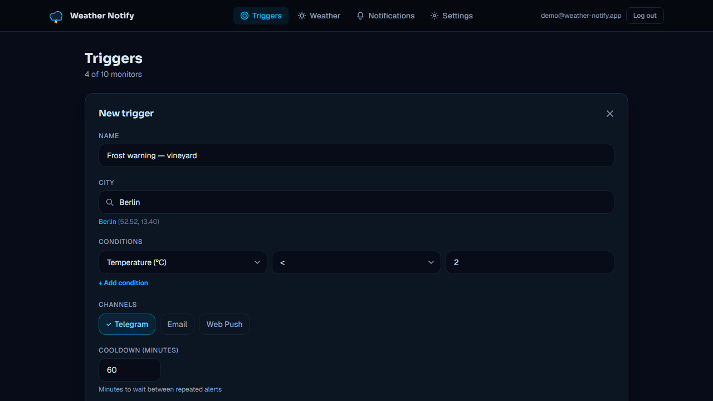
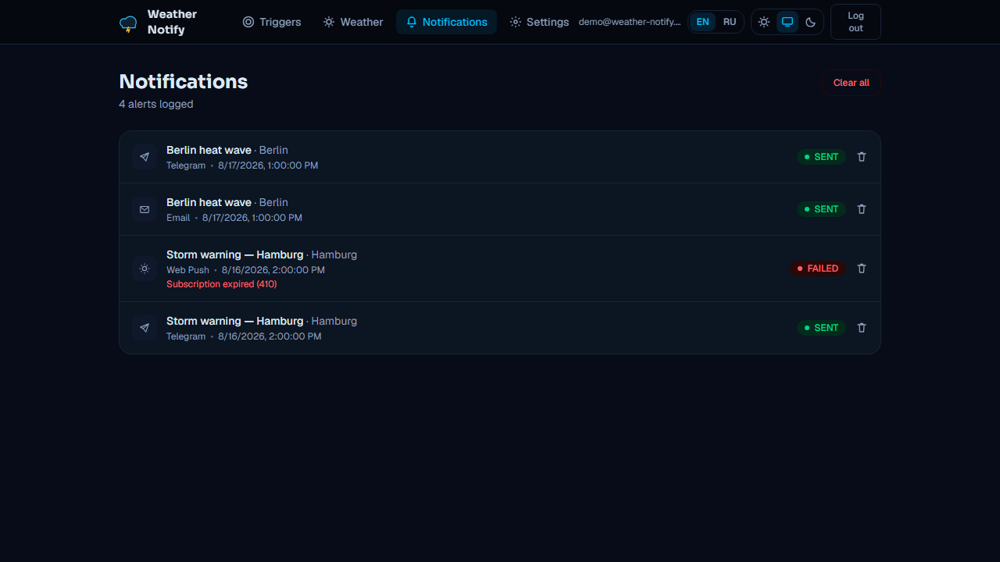
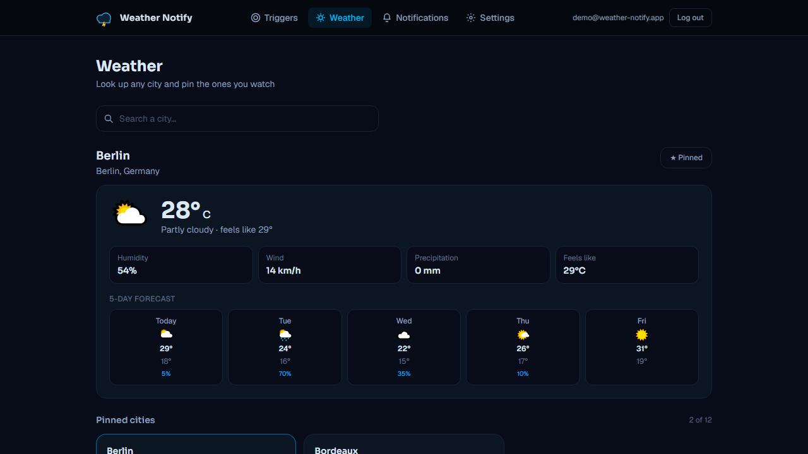
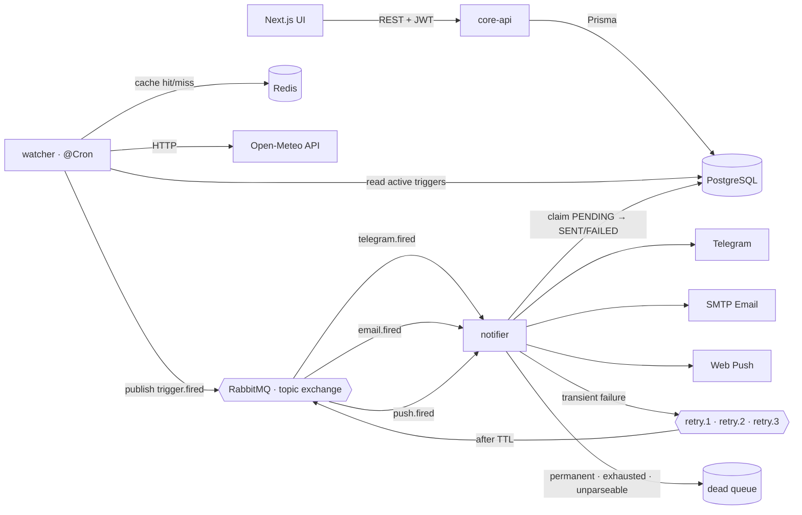

# Weather Notify — Event-Driven Alerting System (Backend)

Microservice backend that lets users define **weather triggers** (custom thresholds or
severe-weather alerts for a city) and delivers notifications over **Telegram, Email and
Web Push**. Built as a NestJS monorepo with an asynchronous, message-driven core.

> Frontend lives in a separate repository: `weather_notify_web` (Next.js).


<details>
<summary>More screens — trigger builder, delivery history, forecast</summary>

**Building a trigger.** Conditions combine with AND/OR, the city comes from a
geocoder, and the cooldown is what stops a sustained condition from alerting
every cycle.



**Delivery history.** One row per alert per channel, with the failure reason
kept when a channel refuses — here a push subscription the browser expired.



**Forecast.** Current conditions and five days for any city, served through the
API rather than called from the browser ([ADR 0009](docs/adr/0009-proxying-the-upstream.md)).



</details>

## Architecture


```mermaid
flowchart LR
    UI[Next.js UI] -->|REST + JWT| API[core-api]
    API -->|Prisma| PG[(PostgreSQL)]
    WATCH[watcher · @Cron] -->|read active triggers| PG
    WATCH -->|cache hit/miss| REDIS[(Redis)]
    WATCH -->|HTTP| OM[Open-Meteo API]
    WATCH -->|publish trigger.fired| MQ{{RabbitMQ · topic exchange}}
    MQ -->|telegram.fired| NOTIF[notifier]
    MQ -->|email.fired| NOTIF
    MQ -->|push.fired| NOTIF
    NOTIF --> TG[Telegram]
    NOTIF --> MAIL[SMTP Email]
    NOTIF --> WP[Web Push]
    NOTIF -->|claim PENDING → SENT/FAILED| PG
    NOTIF -->|transient failure| RETRY{{retry.1 · retry.2 · retry.3}}
    RETRY -->|after TTL| MQ
    NOTIF -->|permanent · exhausted · unparseable| DEAD[(dead queue)]
```

## Services

| Service | Role |
|---------|------|
| **core-api** | REST API: JWT auth, triggers CRUD, user/Telegram/push management, notifications history, the Open-Meteo proxy the UI reads through, Swagger (dev only) |
| **watcher** | `@Cron` job: groups active triggers by location, polls Open-Meteo (Redis-cached), evaluates conditions, publishes `trigger.fired` |
| **notifier** | Consumes per-channel queues, delivers via Telegram/Email/Web Push with retry/DLQ, persists every outcome |

Shared code lives in `libs/`:

| Library | Contents |
|---------|----------|
| **domain** | Condition evaluation, quiet hours, the trigger state machine, and the enums the system is defined in terms of. Zero imports of Nest, Prisma or IO — enforced by an eslint rule. |
| **contracts** | Event shapes, routing keys, message headers and the `EventPublisher` port. |
| **database** | Prisma client, plus a compile-time assertion that the schema's enums still match the domain's. |
| **common** | Infrastructure: config validation, Redis, mailer, metrics, log correlation, the RabbitMQ publisher. |

## Architecture decisions

Decisions worth arguing about, with what each one **gave up**, live in
[`docs/adr/`](docs/adr/). The load-bearing ones:

| # | Decision | Why |
|---|----------|-----|
| [0001](docs/adr/0001-microservices-and-a-broker.md) | Three services and a broker | Failure isolation, not scale — a five-minute SMTP outage must not stall the poll cycle |
| [0002](docs/adr/0002-domain-purity-not-clean-architecture.md) | One boundary, not full Clean Architecture | `libs/domain` imports nothing, enforced by eslint; the rest may be infrastructure |
| [0003](docs/adr/0003-persistence-depends-on-the-domain.md) | `libs/database` knows the domain | A compile-time assertion where the two vocabularies meet |
| [0004](docs/adr/0004-cqrs-in-one-module.md) | CQRS in `triggers` only | One module with commands says the split was a decision; every module saying it says nothing |
| [0005](docs/adr/0005-a-queue-per-retry-stage.md) | One retry queue per delay | A shared queue head-of-line blocks |
| [0006](docs/adr/0006-idempotency-claim-as-a-lease.md) | The claim is a lease | `PENDING` alone cannot tell a live consumer from a dead one |
| [0007](docs/adr/0007-transactional-outbox.md) | The watcher never publishes directly | A crash between publish and record fires a second, unrecognisable event |
| [0008](docs/adr/0008-openapi-as-the-client-contract.md) | A committed OpenAPI document | A shared package's guarantee without a registry |
| [0009](docs/adr/0009-proxying-the-upstream.md) | The browser talks to one origin | A third party's uptime should not be a visible feature's uptime |
| [0010](docs/adr/0010-sharding-the-watcher.md) | The watcher shards by location | Instances agree without talking to each other |
| [0011](docs/adr/0011-denying-tokens-for-a-deleted-account.md) | A deny marker for deleted accounts | A stateless token cannot know its account is gone |

## Using this as a starting point

Weather is the signal, not the architecture. The outbox, the idempotency lease,
the retry ladder and the anti-spam state machine apply to anything shaped like
*watch a signal, alert when it crosses a line* — prices, uptime, stock levels,
sensors.

[**docs/using-this-as-a-template.md**](docs/using-this-as-a-template.md) is the
short version: four files decide what the system watches, and everything else
stays. MIT licensed — see [CONTRIBUTING.md](CONTRIBUTING.md) to work on it and
[SECURITY.md](SECURITY.md) before deploying a fork.

## Key features

- **Multi-condition triggers** with AND/OR logic (e.g. *temp > 30 °C **and** wind > 40 km/h*).
- **Anti-spam state machine** (`ARMED` → `FIRED`) with per-trigger cooldown and hysteresis.
- **Quiet hours** — per-user, timezone-aware do-not-disturb window (wraps past midnight).
- **Three delivery channels** behind a registry — adding one is a single array entry,
  with the queue topology derived from it.
- **Exactly-once delivery in practice** on top of at-least-once transport, via a
  `(eventId, channel)` claim.
- **Staged retry + a real dead-letter queue** with the reason recorded on the message.
- **Email verification** (soft gate) and **Telegram deep-link binding** via long-polling bot.
- **Prometheus metrics** on a separate, unpublished port, scraped by the stack itself,
  with alert rules routed to a person through Alertmanager; structured logging via pino
  with per-delivery correlation.
- **Scheduled backups** that verify the archive and a restore CI actually performs.
- **Horizontal scale for the poller** — shard by a hash of the location, no coordination.
- **Generated client contract** — `openapi.json` is committed and CI fails if it drifts.

## Security

- **Auth** — bcrypt (cost 12) password hashing; short-lived access JWT + rotating refresh
  token stored **hashed** in the DB. Refresh rotation includes **reuse detection**: replaying
  an already-rotated token revokes the user's entire token family.
- **Deleting an account stops its tokens.** An access token is stateless and valid for its
  full lifetime, so deletion — by the user or by an admin — writes a deny marker for that
  window; a demotion does the same, since the role rides in the token
  ([ADR 0011](docs/adr/0011-denying-tokens-for-a-deleted-account.md)).
- **Sign-in is bounded per address, not only per caller.** The IP throttler is the wrong
  unit for guessing at one mailbox — a list of hosts divides it at no cost to the attacker —
  so ten failures against an address stop it being tried for fifteen minutes, however the
  attempts were spread. The counter is keyed by a digest of the address, not the address,
  and it fails open: a Redis outage must not lock out everybody at once.
- **Login answers in the same time whether or not the address exists.** The password
  comparison runs against a placeholder hash for an unknown address, so the route cannot be
  used to enumerate accounts. `forgot-password` matches it in body, status, and by handing
  the mail off instead of awaiting an SMTP round-trip only the known path would reach.
- **Password reset** consumes a fingerprinted, one-hour token and revokes every session in
  the same transaction as the password write.
- **Refresh token transport** — delivered in an `httpOnly`, `SameSite`, path-scoped cookie
  (never exposed to JS); `Secure` in production.
- **Hardening** — `helmet`, explicit CORS allow-list (no wildcard reflection), global +
  per-route rate limiting (`@nestjs/throttler`), `ValidationPipe` with
  `whitelist`/`forbidNonWhitelisted`.
- **Input validation** — every DTO is validated (class-validator); IANA timezones and
  push endpoints are checked, and user-supplied text is HTML-escaped in outgoing emails.
- **Fail-fast config** — environment is validated with zod at boot; secrets must be ≥ 32
  chars and cannot be left as placeholders. `COOKIE_SAMESITE` is an enum, since the value
  is written into a `Set-Cookie` attribute where a typo is discarded by the browser rather
  than rejected by anything; `"none"` additionally requires `NODE_ENV=production`, which is
  what marks the cookie `Secure` — without it the browser drops the cookie and every reload
  looks like a signed-out user. Grafana's admin password has no default either: the compose
  file stops if it is unset.
- **Least privilege** — Docker images run as a non-root user; infra ports bind to loopback.

## Tech stack

Node 22 · TypeScript · NestJS 11 · Prisma 6 + PostgreSQL · RabbitMQ ·
Redis · Passport/JWT · Open-Meteo · Nodemailer (SMTP) · web-push · Docker Compose · GitHub Actions.

## Anti-spam design

Each trigger has a state machine (`ARMED` → `FIRED`) plus a per-trigger `cooldownMin`.
The two answer different questions and both have to agree before an alert goes out.
The state machine asks whether this is a *new* crossing: a trigger fires when the
condition first becomes true, and re-arms once it clears (hysteresis), which is what
stops a sustained condition — "temperature > 30 °C" through an August afternoon — from
alerting every cycle. The cooldown asks how often a crossing may be *delivered*, and
is measured from the last firing alone.

Keeping the cooldown blind to the state is the part worth stating, because the
obvious shortcut is wrong: letting ARMED mean "cooldown does not apply" reads fine
until the condition oscillates around its threshold. Every clear re-arms it, so the
gate is open on the next poll, and a temperature hovering at the limit delivers on
every cycle against an hourly cooldown. Only `lastFiredAt` can answer "how long since
the user last heard from us".

The transition is a pure function in `libs/domain`:

```ts
decide(trigger, evaluation, now, quietHours): 
  | { kind: 'FIRE' }
  | { kind: 'SUPPRESS'; reason: 'cooldown' | 'quiet_hours' }
  | { kind: 'REARM' }
  | { kind: 'NOOP' }
```

The watcher is the orchestrator around it: fetch, evaluate, decide, persist. Two
things fall out of that shape. The whole matrix — state × cooldown × quiet hours,
including the boundaries — is table-testable without a single mock. And the
suppression reason becomes a metric label for free, which is what answers the
question users actually ask: *why didn't I get an alert?*

## Reliability

At-least-once delivery is not a feature you enable; it is a property you are
stuck with the moment a broker is involved. Everything below exists because of it.

### The retry ladder

Three retry queues per channel, with escalating TTLs (5 s / 30 s / 5 min by
default, `NOTIFIER_RETRY_DELAYS_MS`). A failed delivery is republished onto the
next stage with an explicit `x-attempts` header and the original is acked.

```
notifications.email            ← consumed
notifications.email.retry.1    TTL 5s    ─┐
notifications.email.retry.2    TTL 30s   ─┼─→ dead-letters back to notifications.email
notifications.email.retry.3    TTL 5m    ─┘
notifications.email.dead                   ← terminal, nothing consumes it
```

One queue per stage rather than per-message TTLs, because a RabbitMQ queue only
expires messages from its head — a shared queue head-of-line blocks
([ADR 0005](docs/adr/0005-a-queue-per-retry-stage.md)).

The attempt count travels in a header rather than being read from `x-death`,
which is unreliable across repeated main↔retry bounces.

### The dead-letter queue

Everything terminal is parked in `notifications.<channel>.dead` with an
`x-dead-reason` header:

| Reason | Meaning |
|--------|---------|
| `unparseable` | The payload was not JSON. Never retryable, and previously dropped silently. |
| `permanent` | The channel said retrying cannot help — unlinked Telegram chat, unverified email, missing VAPID keys. |
| `attempts_exhausted` | Every retry stage was tried. |

Nothing consumes these queues; messages sit there with their payload intact until
someone looks. **To replay**, publish the message body back onto
`notifications` with the channel's `.fired` routing key and no `x-attempts`
header. The idempotency claim makes this safe: a message that in fact succeeded
before will be skipped rather than delivered twice.

### Idempotency

`Notification` carries a unique `(eventId, channel)`. Delivery claims that pair as
`PENDING` **before** calling the channel and settles it to `SENT` or `FAILED`
after. A redelivery that finds an existing `SENT` row is skipped and counted.

This is not defensive programming against a hypothetical. The failure path
publishes to the retry queue and *then* acks the original; a crash between those
two lines leaves the message on both queues, and the second copy would be
delivered again. The unique index is the arbiter, so two consumers racing on the
same redelivery cannot both win.

A claim is a **lease**, not a flag: `claimedAt` dates the attempt, so a
take-over matches only rows nobody holds and a consumer that died mid-send is
distinguishable from one still inside the channel call
([ADR 0006](docs/adr/0006-idempotency-claim-as-a-lease.md)). A row still
`PENDING` with an expired lease is therefore a real signal: a notifier died
mid-send.

One claim covers one channel, which is the wrong grain for **web push**: it fans
out to every browser subscription the user registered, and one of them failing
retries the event as a whole. `deliveredTo` records the endpoints an attempt
actually reached, so the retry re-sends only to the devices still owed the alert.

### Transactional outbox

The claim above only recognises a duplicate of the *same* event, so publishing
before recording the firing would defeat it — a crash in between fires again
next cycle under a fresh `eventId`, which the consumer cannot recognise as a
repeat ([ADR 0007](docs/adr/0007-transactional-outbox.md)).

So the watcher does not publish at all. `commitFire` writes the condition
observations, the trigger's new state and one `OutboxEvent` row per channel in a
single transaction, and `OutboxRelayService` hands those rows to the broker
afterwards, marking each only once the broker has accepted it. The cycle nudges
the relay immediately so latency is unchanged; a cron pass every 30 seconds is
what makes the delivery guaranteed rather than best-effort, covering a broker
outage or a process that dies mid-publish. A pass stops at its first failure, so
events reach the exchange in the order they fired, and a row that was published
but not yet marked is simply redelivered — which lands back on the
`(eventId, channel)` claim.

Relayed rows are swept after 24 hours; `watcher_outbox_pending` is the gauge to
alert on, since a growing backlog means the relay is not keeping up. It counts
the staged rows directly rather than measuring the batch it just drained — a
batch is capped at `OUTBOX_BATCH_SIZE`, so a gauge derived from it would sit at
exactly that number however far behind the relay fell.

### Retention

`Notification` is append-only — one row per alert per channel, payload included —
so it grows with uptime, not with usage. A nightly sweep in core-api deletes rows
older than `NOTIFICATION_RETENTION_DAYS` (90 by default) in bounded chunks, under
a Redis lock so replicas do not contend over the same rows. `OutboxEvent` is kept
for 24 hours after relay.

### Backups

Everything above protects a *message*. None of it survives losing the volume,
which on a single-VM deployment is the failure that actually ends the service —
so the `db-backup` sidecar dumps Postgres on a schedule and ships with the
stack rather than living in a host crontab nobody reprovisions.

Each run writes a custom-format dump, **verifies it is a readable archive**
(`pg_restore --list`) before keeping it, and prunes copies older than
`BACKUP_RETENTION_DAYS`. A dump is written to `.part` and renamed only when it
completes, so a crash mid-dump cannot leave a truncated file that looks like a
finished backup. A failed run logs and waits for the next window instead of
exiting, because a container that stops is a backup that stops.

Local dumps survive a dropped table, not a lost VM. Setting `BACKUP_S3_BUCKET`
plus AWS credentials mirrors each one off-site — any S3-compatible store works
(`AWS_ENDPOINT_URL` for B2, R2 or MinIO). A failed upload keeps the local copy.

**To restore** — the procedure lives next to the thing that writes the files, so
the two cannot drift:

```bash
docker compose stop core-api watcher notifier      # nobody holds a connection
docker compose run --rm -T db-backup /scripts/restore.sh /backups/<file>.dump
docker compose start core-api watcher notifier
```

`RESTORE_TARGET_DB` points the restore at a scratch database instead of the
live one, which is how this gets rehearsed rather than first attempted on the
day it matters. A backup nobody has restored is a hypothesis.

### Shutdown and health

`/health` is liveness and answers 200 as long as the process runs — restarting it
would not fix a broker outage. `/ready` reports the dependencies, and Compose
health checks gate on it, which is what `depends_on: service_healthy` always
meant.

On `SIGTERM` the notifier cancels its consumers, waits for in-flight deliveries to
finish, and only then closes the channel. Tearing the channel down mid-send would
leave the message unacked and force a redelivery the idempotency claim then has to
absorb.

## Observability

Logs are JSON via pino. Every line a message handler emits carries `eventId`,
`channel` and `attempt` automatically: the event id rides an `x-event-id` header
through every main/retry/dead bounce, and an `AsyncLocalStorage` context feeds
pino's `mixin`. That is what makes a single delivery traceable across three
services and several requeues.

Metrics are Prometheus, on a separate unpublished port per service — and the
stack scrapes them itself. `prometheus` collects all three services over the
internal network and evaluates the rules in `ops/prometheus/alerts.yml`;
`grafana` comes up with its datasource and dashboard already provisioned from
files in the repository, so a panel change is a diff rather than a click
nobody else can see. Both bind to loopback: reach them over an SSH tunnel
instead of publishing an unauthenticated query interface.

| Where | Port |
|-------|------|
| Grafana | <http://127.0.0.1:3005> (`GRAFANA_USER`/`GRAFANA_PASSWORD`) |
| Prometheus | <http://127.0.0.1:9090> |
| Alertmanager | <http://127.0.0.1:9093> |

The rules page on what the system cannot recover from by itself — a service
that stays unscraped, an outbox backlog that is not draining, sustained
dead-lettering, a channel failing the majority of its deliveries, a poll cycle
outgrowing its interval, a queue backing up. Anything the retry ladder or the
relay already absorbs is a graph, not a page.

### Where an alert goes

Prometheus decides an alert is firing; **Alertmanager** decides who hears about
it. Set `ALERT_WEBHOOK_URL` (Slack, Discord, Telegram — anything that accepts a
POST) or `ALERT_EMAIL_TO`, which reuses the SMTP credentials the application
already has. A webhook wins when both are set. With neither, alerts still fire
and are visible in the UI but reach nobody — and the container says so loudly
at startup rather than looking like a system with no alerts.

Routing is where the noise is controlled, and three rules do most of it.
Alerts group by name and service, so an incident that trips several rules
arrives as one message. `critical` skips the group timer and repeats hourly;
`info` is deliberately routed to a receiver that notifies nobody, because
"the cache hit ratio is low" is a graph. An inhibit rule drops warnings for a
service already reporting `critical` — a process that is down will also stop
reporting its queue depth, and sending the consequence next to the cause is how
one failure becomes a wall of pages.

Alertmanager expands no environment variables in its config, so the container
renders `alertmanager.tmpl.yml` at startup. CI asserts Prometheus discovered it
and that the rendered config parsed.

| Metric | Labels | Answers |
|--------|--------|---------|
| `watcher_cycle_duration_seconds` | — | Is a poll cycle outgrowing its interval? |
| `watcher_triggers_evaluated_total` | — | Evaluation volume |
| `watcher_triggers_fired_total` | — | Firing volume |
| `watcher_suppressed_total` | `reason` | Why an alert did not arrive |
| `watcher_weather_cache_total` | `result` | Is the Redis cache actually working? |
| `watcher_weather_fetch_failures_total` | — | Is Open-Meteo down? |
| `notifier_notifications_total` | `channel`, `status` | Delivery outcomes |
| `notifier_delivery_duration_seconds` | `channel`, `outcome` | Per-channel latency, failures kept out of the success percentiles |
| `notifier_retries_total` | `channel` | Transient-failure rate |
| `notifier_dead_lettered_total` | `channel`, `reason` | What is being parked, and why |
| `notifier_duplicates_skipped_total` | `channel` | How often at-least-once actually bites |
| `core_api_http_request_duration_seconds` | `method`, `route`, `status` | API latency |
| `core_api_auth_events_total` | `type` | Login/refresh/failure rates |

**Cardinality rule: no `triggerId` or `userId` in labels, ever.** Every label
combination is a separate time series held in memory by both the process and
Prometheus; a per-user label turns one metric into one per user and grows without
bound. Identity belongs in logs, which are searchable and can be dropped; labels
are for values from a small, fixed set. That is why `reason` and `outcome` are
labels and `eventId` is not.

## Getting started

```bash
cp .env.example .env          # set JWT secrets (≥32 chars) + channel secrets
docker compose up -d          # postgres, redis, rabbitmq + all three services
```

Local development (services on the host, infra in Docker):

```bash
docker compose up -d postgres redis rabbitmq
npm install
npm run db:migrate            # apply migrations
npm run start:core-api        # + start:watcher / start:notifier in separate shells
```

- Swagger UI (dev only): <http://localhost:3000/docs>
- RabbitMQ management UI: enable the `15672` port in `docker-compose.yml` (dev only)

## Environment

| Variable | Description |
|----------|-------------|
| `DATABASE_URL` | PostgreSQL connection string |
| `REDIS_URL` | Redis connection string (cache + cooldowns) |
| `RABBITMQ_URL` | RabbitMQ AMQP URL |
| `JWT_ACCESS_SECRET` / `JWT_REFRESH_SECRET` | JWT signing secrets (**≥ 32 chars**, no placeholders) |
| `JWT_ACCESS_TTL` / `JWT_REFRESH_TTL` | Token lifetimes (e.g. `15m`, `7d`) |
| `CORS_ORIGIN` | Comma-separated allow-list of frontend origins |
| `COOKIE_SAMESITE` | Refresh-cookie `SameSite` (`lax` default; `none` for cross-site frontends) |
| `TELEGRAM_BOT_TOKEN` / `TELEGRAM_BOT_USERNAME` | Telegram bot credentials (optional) |
| `SMTP_HOST` / `SMTP_PORT` / `SMTP_USER` / `SMTP_PASS` / `MAIL_FROM` | SMTP mailer (optional; links logged if unset) |
| `VAPID_PUBLIC_KEY` / `VAPID_PRIVATE_KEY` / `VAPID_SUBJECT` | Web Push (VAPID) keys (optional) |
| `WATCHER_CRON` | Polling cadence (default every 5 min) |
| `NOTIFIER_RETRY_DELAYS_MS` | Comma-separated retry stage delays; one queue per stage (default `5000,30000,300000`) |
| `NOTIFIER_PREFETCH` | Unacked messages per consumer (default 10) |
| `CORE_API_PORT` | Public API port (default 3000) |

## API contract

The OpenAPI document is generated from the controllers and **committed** as
`openapi.json`:

```bash
npm run openapi         # regenerate
npm run openapi:check   # regenerate and fail on a diff (runs in CI)
```

The dump runs Nest in preview mode, which builds the module graph and route
metadata without instantiating providers — so it needs no Postgres, Redis or
RabbitMQ and is reproducible anywhere. The frontend generates its types from that
file with `openapi-typescript` (`npm run gen:api` there), which is why every route
carries an explicit response DTO: without one the document's response schemas are
empty and there is nothing to generate from.

`GET /meta` serves the limits the API enforces (trigger count, conditions per
trigger, cooldown bounds, test-send cooldown) so clients can disable a control
instead of duplicating the numbers. They were duplicated before, and had drifted:
the dashboard advertised twenty triggers against a server limit of ten, so the
button stayed enabled and the API answered 400.

No shared npm package between the two repositories — that would need a registry
and synchronised releases. OpenAPI gives the same guarantee one-directionally,
with no infrastructure.

## Testing

```bash
npm test          # unit + cross-service suites
npm run test:e2e  # auth + triggers + admin against a real Postgres
```

Four layers, each catching what the others cannot:

- **Pure unit** — the state machine's full transition matrix, condition
  evaluation, quiet hours. No mocks; that is what extracting the domain bought.
- **Classification** — which delivery errors are permanent and which are
  transient. The retry ladder is only correct if the channels get this right, and
  web push must prune a dead endpoint on 404/410 while propagating a 503 rather
  than deleting a live subscription.
- **Cross-service** (`test/`) — the critical path (snapshot → decide → publish →
  consume → deliver → `SENT`, then a redelivery that must not send twice) and the
  failure path (a permanently failing channel climbing every retry stage and
  parking in the dead queue). Wired through the ports, so no broker or database is
  involved; the in-memory notification store enforces the same unique
  `(eventId, channel)` constraint as the migration, so the idempotency assertions
  cannot pass vacuously.
- **Smoke** — CI boots the real Compose stack and asserts every service reaches
  `/ready`, that all fifteen queues exist in RabbitMQ, and that an unverified user
  still gets a 403 from `POST /triggers`. Fakes cannot catch a wrong queue
  argument.

CI runs lint, typecheck, the OpenAPI freshness check, unit + e2e with a coverage
gate, and the smoke job.

## Scaling and known limits

Honest list of what would break first, and what it would take.

**The watcher scales by sharding, and each shard is still single-instance.**
Set `WATCHER_SHARD_COUNT` and give each replica its own `WATCHER_SHARD_INDEX`.
Whole locations are assigned, never individual triggers — a location is what one
upstream call covers, so splitting one would fetch the same coordinates twice.
The assignment needs no leader, no rebalancing protocol and no shared state
beyond the count: a location hashes into one of 1024 fixed buckets, and an
instance owns the buckets where `bucket % count == index`.

The bucket is stored on the row (`Trigger.locationBucket`, stamped by core-api
whenever the coordinates are written) rather than computed while filtering, and
that is the part that makes the split worth anything. Applying it in
application code meant every instance still read the whole active set each
cycle and discarded most of it: the upstream calls divided, the database reads
multiplied by the number of instances. Stored, it is a `WHERE … IN (…)` against
`(isActive, locationBucket)`, so each instance reads its own slice.

The Redis lock stays, one per shard: instances holding different shards run
concurrently, while two configured with the *same* shard still cannot overlap —
which is what a redeploy briefly produces. It is renewed per location as the
cycle walks them, because a cycle that polls locations one at a time outlives
any fixed TTL once the trigger set grows.

Rebalancing is the part that is not solved: changing `WATCHER_SHARD_COUNT`
reassigns most locations at once, so a rolling change has a window where a
location is owned by two instances or by none. Restarting the watchers together
is the honest answer at this size; consistent hashing is what removes it.

**Telegram polling is single-instance too, but core-api is not.** The API scales
horizontally; `getUpdates`, which Telegram refuses to serve to two pollers at
once, is elected through a renewed Redis lock, so extra replicas stand by and
take over within the lock's TTL if the poller stops. A webhook would remove the
election entirely, at the cost of a publicly reachable HTTPS endpoint.

**Open-Meteo is polled a few locations at a time.** Locations are deduplicated
(triggers rounded to two decimals share one call) and cached in Redis for four
minutes, so the current cost is low. The TTL is deliberately under the poll
interval: a longer-lived entry is handed back to the next cycle, which then
re-evaluates data the previous one already acted upon — writes and wall time
spent on a decision that cannot come out differently.

`WATCHER_CONCURRENCY` (default 5) bounds how many are in flight. A location is
one request and the writes behind it, which is almost entirely waiting, so a
strictly serial pass costs the sum of every round-trip and overruns a five-minute
tick at a few hundred locations — well before the trigger count is interesting.
The cap is what keeps the alternative from being a burst at an upstream we do not
control. Open-Meteo also accepts batched coordinates, which is where this goes if
the location count grows faster than the cache and the pool absorb it.

**The UI's own Open-Meteo calls go through the API.** City search and the
weather page used to call Open-Meteo from the browser, which made a third
party's CORS policy, quota and uptime part of the app's critical path — and put
the failure where only users could see it. `GET /geocode` and `GET /weather`
proxy both, cached in Redis (24h for coordinates, which do not move; 5 minutes
for a forecast someone is looking at) and rate-limited per caller. The forecast
cache is keyed by the same two-decimal rounding the watcher groups triggers by,
so two people viewing one city cost one upstream call. That also let the
frontend's CSP drop its `*.open-meteo.com` wildcard: the browser now talks to
one origin.

**Notification history lives in the primary database.** It is append-only, never
joined against, and read as one paginated list. It will outgrow the tables the API
actually queries; the natural move is a separate store with a retention policy.

**Alert delivery is only as good as its channel.** Alertmanager routes to a
webhook or to email, both of which are the same kind of thing the notifier
already depends on — if SMTP is what is broken, the alert about SMTP will not
arrive either. A second, independent channel (a pager service, an SMS gateway)
is the standard answer and is not wired up here.

## Deployment

Runs 24/7 for free on an **Oracle Cloud Always Free** ARM VM via `docker compose up -d`
(no cold starts). All three services build from a single parameterized `Dockerfile`
(`APP` build arg) and run as a non-root user. See `weather_notify_web` for the matching
frontend deploy (Vercel).

---

Created by [Aliaksei Konyshau](https://www.al-gres.com/).
